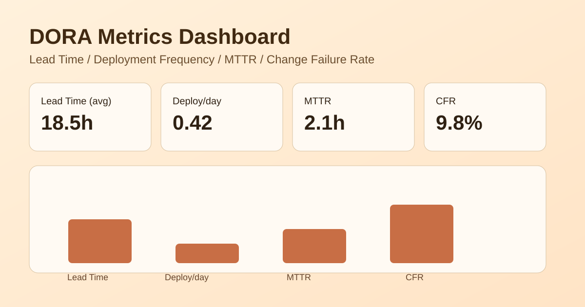

# 온디바이스 AI 기반 민원 데이터 심층 분석 및 검색 시스템 (AI-Civil-Affairs-Systems)
인터넷 연결이 차단된 로컬 폐쇄망 환경에서도 공공 민원 데이터를 안전하게 보호하며, 비정형 텍스트를 구조화하고 과거 유사 사례 검색부터 근거 기반 답변 초안 생성까지 일관 처리하는 보안 특화 On-Device AI 조력자 시스템입니다.

## 🎯 Features
- 텍스트 구조화 및 엔티티 추출 (Structuring & NER) // 복잡한 민원 원문에서 4요소(Observation, Result, Request, Context)와 주요 정보(장소, 시간, 시설물 등)를 분리 및 JSON 구조화하여 지식 자산화
- 의미 기반 유사 민원 검색 (Semantic Search) // 단순 키워드 매칭을 넘어 BGE-m3 임베딩과 벡터 DB(ChromaDB/FAISS)를 통한 하이브리드 검색 및 메타데이터 필터(기간/지역)를 통해 정확한 과거 유사 참조 사례 도출 (Recall@5 0.85 이상)
- 근거 기반 답변 생성 (RAG) // Ollama 및 로컬 sLLM 기반으로 근거 문구 및 출처 청크 ID를 하이라이팅하여 환각을 방지하고 설명 가능성(XAI) 부여
- 사용자 친화적 데모 UI // Streamlit을 통해 민원 업로드 및 구조화 결과 확인, 질의응답 챗 인터페이스, 관리자용 통계 대시보드를 시각적으로 제공

## 🚀 Getting Started

### Prerequisites
- Python 3.10+
- Docker & Docker Compose (선택)
- Ollama (로컬 LLM 구동용)
- 권장 하드웨어: VRAM 6GB 이상 또는 RAM 16GB 이상 (4-bit 양자화 기준)

### Installation
```bash
git clone https://github.com/hyunsuki5329/AIOSS.git
cd AIOSS
pip install -r requirements.txt
```

### Monitoring with Docker Compose (Prometheus + Grafana)
```bash
# Run monitoring stack in background
docker compose up -d

# Check status
docker compose ps

# Stop monitoring stack
docker compose down
```

- Prometheus: http://localhost:9090
- Grafana: http://localhost:3000
- Grafana default account: `admin` / `admin`
- Grafana starts with Prometheus datasource auto-provisioned (name: `Prometheus`)
- Grafana starts with dashboard auto-provisioned and set as home: `Prometheus Overview`

### Usage
```bash
# 1. 로컬 LLM 서빙 엔진 실행 (백그라운드)
ollama serve

# 2. 필수 모델 풀 (예: qwen2.5:7b-instruct)
ollama pull qwen2.5:7b-instruct

# 3. 백엔드 API 서버 실행 (FastAPI)
uvicorn app.main:app --reload --host 0.0.0.0 --port 8000

# 4. 프론트엔드 UI 실행 (Streamlit)
streamlit run frontend/app.py
```

## 🧪 Testing
```bash
# 오프라인 평가: 구조화 필드 F1 Score, 검색 Recall@5, 질의 지연시간 검증
pytest tests/
```

## 📊 DORA Metrics Automation (GitHub Actions)

자동 수집 대상 지표:
- Lead Time for Changes
- Deployment Frequency
- Mean Time to Recovery (MTTR)
- Change Failure Rate (CFR)

워크플로우:
- `.github/workflows/metrics.yml`

실행 방식:
- 매주 월요일 00:00 UTC 자동 실행 (`schedule`)
- 수동 실행 (`workflow_dispatch`, `window_days` 입력 가능)

산출물:
- JSON 아티팩트: `artifacts/dora-metrics.json`
- 주간 보고서 아티팩트: `artifacts/weekly-report.md`
- 대시보드 데이터: `artifacts/dashboard-data.json`

선택 과제 반영:
- 주간 실행 시 `reports/weekly-dora-report.md` 자동 갱신/커밋
- 대시보드 샘플 데이터 `dashboard/sample-dora-metrics.json` 자동 갱신/커밋

## 🗂 GitHub Project Sprint Backlog Setup

과제용 GitHub Project/이슈 템플릿/라벨/마일스톤/백로그 자동 생성과
선택과제(Cycle Time, Velocity, Burndown) 분석 절차는 아래 가이드를 참고하세요.

- `docs/github-project-sprint-guide.md`

## 🖼 Dashboard Draft / Result

대시보드 구현 파일:
- `dashboard/index.html` (Chart.js 기반)
- `dashboard/sample-dora-metrics.json` (렌더링 데이터)

README 첨부용 시안 이미지:



로컬에서 대시보드 확인:

```bash
# 정적 파일 서버 예시 (Python)
python -m http.server 8080
# 브라우저 접속: http://localhost:8080/dashboard/
```

## 📝 License
MIT License

## ⚙ Workflow Optimization

워크플로우 재사용과 캐싱, 조건부 배포를 적용한 최적화 자료입니다.

- [Workflow Optimization Report](reports/workflow-optimization-report.md)
- [CI Workflow](.github/workflows/ci.yml)
- [Reusable Node Validation Workflow](.github/workflows/node-validate.yml)
- [Composite Node Setup Action](.github/actions/node-setup/action.yml)

## 🤝 Community

이 저장소는 공개 OSS 협업을 염두에 두고 다음 문서를 함께 유지합니다.

- [CONTRIBUTING](CONTRIBUTING.md) - 기여 방법과 개발 참여 절차
- [CODE_OF_CONDUCT](CODE_OF_CONDUCT.md) - 커뮤니티 행동 규범

## 📚 Project Docs

- [Getting Started](docs/assignment_W5/Getting_Started.md)
- [Development Guide](docs/assignment_W5/Development_Guide.md)
- [Troubleshooting](docs/assignment_W5/Troubleshooting.md)